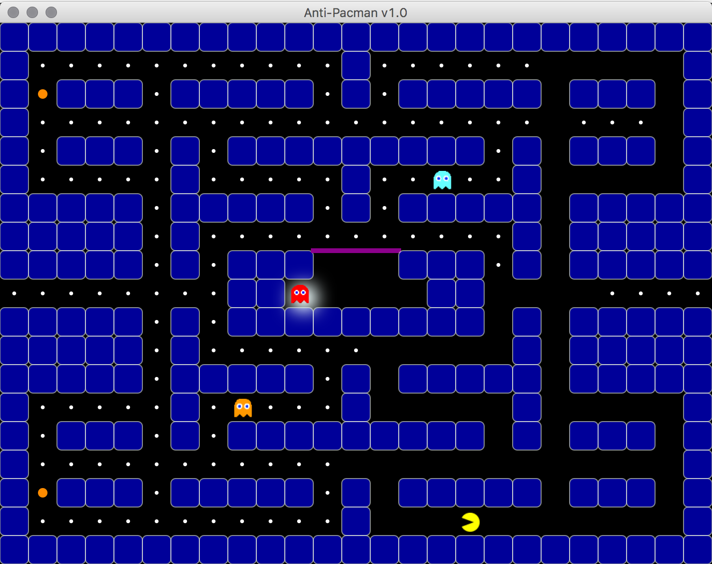
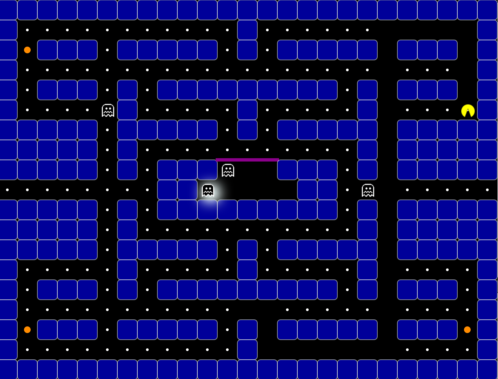
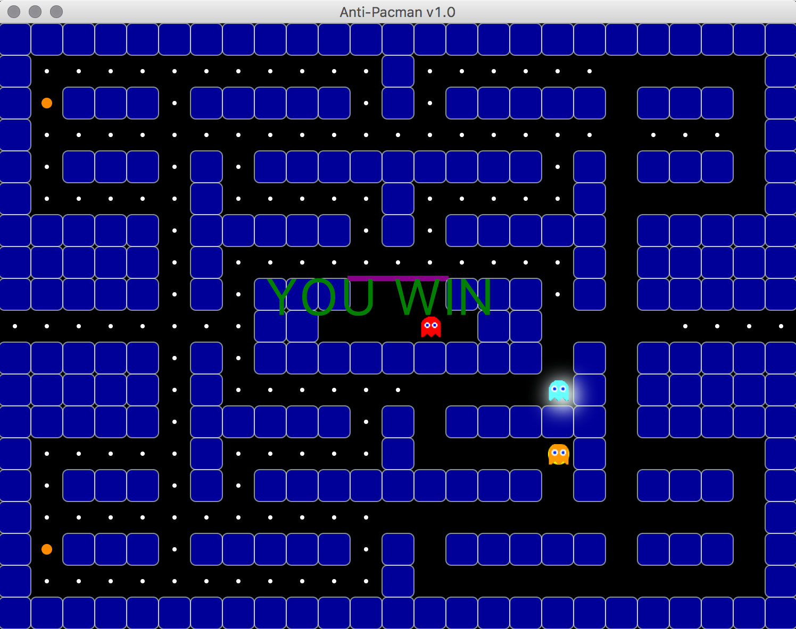

# Anti-Pacman

> Implementation of Anti-Pacman game with simple AI in java

## Documentation

  Game Class :
  
  - handling whole game in launchGame method, first startUp with given Scene(root) will load essential assets of the game such as blocks, dots, ghosts and Pacman itself, Then the game will update in animationTimer handler and keystrokes will be received simultaneously with pressKey handler. And lastly, in onUpdate method different events of the game are being handled for instance moving Pacman and ghost or checking if there is the hollow mode or not.

  Pacman Class:
  
  - with the help of Pathfinder class, there is simple hand-code AI to check where should Pacman go next.
  - the first priority of Pacman is running away from the ghost
  - the second priority of Pacman is going after dots.
  - if there is no ghost nor dots around then Pacman walk randomly.
  
  Ghosts Class:
  
  - only the focused ghost is in control of the player.
  - other ghosts are walking randomly with no AI.

## Example

### Hollow Mode ###

Pacman now can eat ghosts!

### Pacman is captured ###

## Author

  - Soheil Changizi ( [@cocolico14](https://github.com/cocolico14) )

## License

This project is licensed under the MIT License - see the [LICENSE](./LICENSE) file for details

